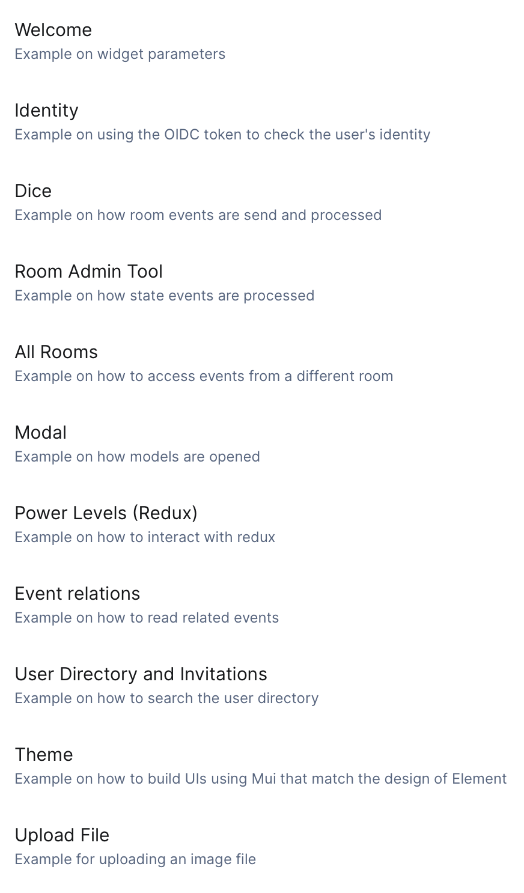

# Matrix Example Widget (Material UI)

This is an example that shows how you can write a Matrix/Element widget.
You can use this package as a starting point for writing new widgets.



The widget demonstrates:

- How to use the available Widget parameters ([`Welcome`](./src/WelcomePage/WelcomePage.tsx)).
- How to obtain and verify an OIDC token ([`Identity`](./src/IdentityPage/IdentityPage.tsx)).
- How to receive and send room events ([`Dice`](./src/DicePage/DicePage.tsx)).
- How to receive and send state events ([`Room Admin Tool`](./src/RoomPage/RoomPage.tsx)).
- How to read data from all rooms ([`All Rooms`](./src/AllRoomsPage/AllRoomsPage.tsx)).
- How to open widget modals ([`Modal`](./src/ModalPage/ModalPage.tsx)).
- How to use Redux for state management ([`Power Levels`](./src/PowerLevelsPage/PowerLevelsPage.tsx)).
- How to read related events ([`Event Relations`](./src/RelationsPage/RelationsPage.tsx)).
- How to search the User Directory ([`User Directory and Invitations`](./src/InvitationsPage/InvitationsPage.tsx)).
- How to use the UI components to match the style of Element ([`Theme`](./src/ThemePage/ThemePage.tsx)).
- How to upload and download files to the media repository ([`Up- and download image`](./src/ImagePage/ImagePage.tsx)).

## Demo

[Click here](https://matrix-widget-toolkit-demo.netlify.app/) and follow the instructions to see it in action.

## Running the examples locally

You should have a local [Node.js LTS](https://nodejs.org) development environment setup with `yarn` available. Then execute the following commands in your terminal:

```bash
git clone https://github.com/nordeck/matrix-widget-toolkit.git
cd matrix-widget-toolkit && yarn install
```

After this, you can run the example widget locally with the following commands:

- `yarn dev:example`: Start the example app.
- `yarn dev:example:https`: Start the example app with a self-signed HTTPS certificate.

The example widget is embedded into the widget host as an iframe.
This can cause mixed-content errors if your local widget is served _without_ HTTPS but the Element hosting it is running _with_ HTTPS.
You have multiple options to solve them:

- Run an own copy of [`element-web`](https://github.com/vector-im/element-web) locally (e.g. via Docker or by building `element-web` from source), _without_ HTTPS and start the widget via `yarn dev`.
- Run your Chrome instance with `--allow-insecure-localhost --disable-site-isolation-trials --disable-web-security` to disable mixed-content errors, use any Element, and start the widget via `yarn start` (_with_ HTTPS).
  > **Warning** Do not use this Chrome instance to browse the web!
- Use a tunneling service such as [`localtunnel`](https://github.com/localtunnel/localtunnel) or [`ngrok`](https://ngrok.com/) to run the widget with a valid HTTPS certificate, use any Element, and start the widget via `yarn dev`.
  This way Chrome behaves closest to how it would behave in production.

Then visit the printed URL and follow the instructions on the page to setup the widget.
