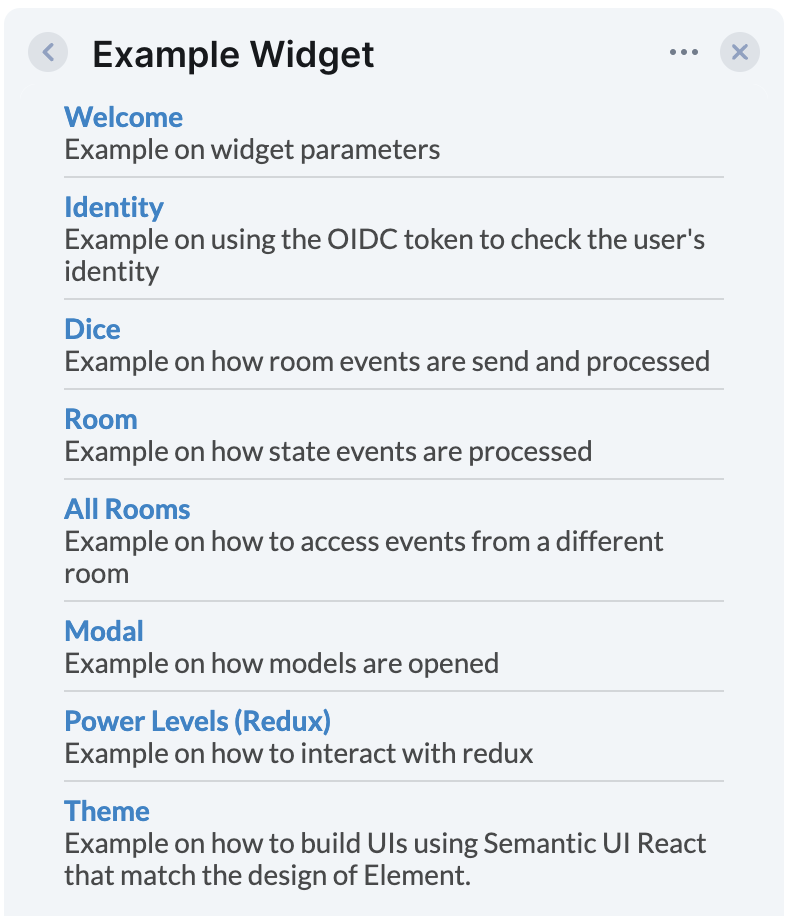

# Matrix Example Widget (Semantic UI)

This is an example that shows how you can write a Matrix/Element widget.
You can use this package as a starting point for writing new widgets.

The widget demonstrates:

- How to receive and send room events ([`DicePage`](./src/DicePage/DicePage.tsx)).
- How to receive and send state events ([`RoomPage`](./src/RoomPage/RoomPage.tsx)).
- How to use Redux for state management ([`PowerLevelsPage`](./src/PowerLevelsPage/PowerLevelsPage.tsx)).
- How to open widget modals ([`Modal`](./src/ModalPage/ModalPage.tsx)).
- How to use the UI components so the widget match the style of Element ([`Theme`](./src/ThemePage/ThemePage.tsx)).
- And other examples…

## Running the Widget Locally

See the [`example-widget-mui` README](../example-widget-mui/) for instructions.
